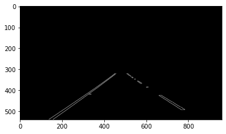

# **Finding Lane Lines on the Road** 

## Writeup 

---

**Finding Lane Lines on the Road**

The goals / steps of this project are the following:
* Make a pipeline that finds lane lines on the road
* Reflect on your work in a written report

---

### Reflection

### 1. Describe your pipeline. As part of the description, explain how you modified the draw_lines() function.

[//]: # (Image References)

[image1]: ./test_images_output/edge.png "Edge detection"
The pipeline starts with the conversion of the color image to a gray image. After this step, a gaussian blur filter with a kernel size of 3 is applied to the gray image to remove noise. Then the edges are detected with the Canny edge detection. As threshold values were 60 for the lower and 150 for the upper was chosen. The result of the edge detection works well as we can see in the result:

After the edges detection, the image is masked with a polygon to obtain the region of interest for the next processing steps.
Then next processing step is find the lines in the images with the edges.

Therefore the Hough line transform was used. As parameters for the Hough transform a rho of 7 and angle of 1°. The threshold is set to 100, which seems a good choice as we can see later in the results. 
My first attempt for rho was 1. This lead in conjunction with the threshold of 100 that we found no lines. With a larger radius, it is more likely that more values are counted and then the threshold is exceeded. With a rho=1 there are not enough points near by that radius.

Since there are short lane markers, the minimum line length is set to 2, to detect them. The line gap parameter is 10. There are two implementations to draw the lines, the draw_lines and draw_lines_ext. The draw_lines function draws the found lines with Hough transformation into the image. 
The result of the this drawing functions can be observed in this image:

The more advantages line drawing happens in the function draw_lines_ext. This function draws instead over multiple lines a single line for each lane. This is done in two steps:

1. separation
For each line segment, the slope and the intercept were computed. In the case a negative slope was computed, the segment is assigned to the left lane. If the slope was positive, it was assigned to the right lane. 

To prevent that a vertical line was wrong assigned, the threshold was at +/- 0.35. For vertical lines, the slope is close to zero. 
Finally, the mean value of the slope and the intercept are computed from the assigned segments. 

2. linear extrapolation

With the knowledge of the intercept and the slope for each line, we know the linear model  y = slope * x + intercept. We defined the corner vertices of the polygon and know the range of y coordinates where the lane is. 
Therefore we can rewrite the previous equation to compute x = (y-intercept)/slope

For the first video, y lies in the range from 320 to 540. These y coordinates are used to compute the start and end coordinates for x.
Now we have start and end coordinates of our lane. We use the y component of our corner vertices as start and end coordinate for
the left/right lane in each video.

With these two approaches we get following result:

The left image is made with draw_lines function and the right one is made with separation and linear extrapolation. 
The separation and linear extrapolation works good. 

### 2. Identify potential shortcomings with your current pipeline

The shortcoming with the most impact on the results of our pipeline is that all parameters are static and adapt not to the environment. 
The fixed vertices of our polygon are different situations not be optimal. 
E.g., when the car drives through a curve, it can lose track of the lanes. 
Vertices, which are too far away, can lead that to obtain wrong information about lanes. There is an information loss since the resolution of the camera system is not high enough. 

I tried the challenge example and observed are various influences from the environment. They influence the edge detection and the hough transform. In the challenge example, it seems there is some kind of dirt on the road, which causes the Hough transform to detect horizontal lines. 
In the first approach, the separation criterium was a positive or negative slope. This approach was not sufficient when there are horizontal lines. With the threshold of +/- 0.35 we reduced the influence of the horizontal lines. 
Another issue is the shadow from the trees. This causes that the lane can not separate clearly from the road pavement.
Thus the thresholds must be reduced. For the first examples the thresholds was 60 and 150, in the challenge example a threshold of 10 and 40 was necessary.

Sometimes it seems to be the case, that the choice of the polygon is not optimal. 

### 3. Suggest possible improvements to your pipeline

Follow improvments are possible:

* Adaptive Threshold for Canny edge detection
One may use the brightness information from the image to compute dynamically new threshold values to match the current environment better and improves the edge detection. 

* Region of interest
Dynamically adapt the corners of our polygon to improve the area for detection.
To mask the area between the two lanes would also help to improve lane detection. Dirt or other things have then no influence on the detection pipeline. 

* Modify the pipeline that the parameters can changed via arguments and not local variables

* A linear model for the lane is sufficient if we drive straight ahead. However, another model would be better in curves.

* Another improvement is that the lane runs smoother. There are small jumps of the lane between the frames. 